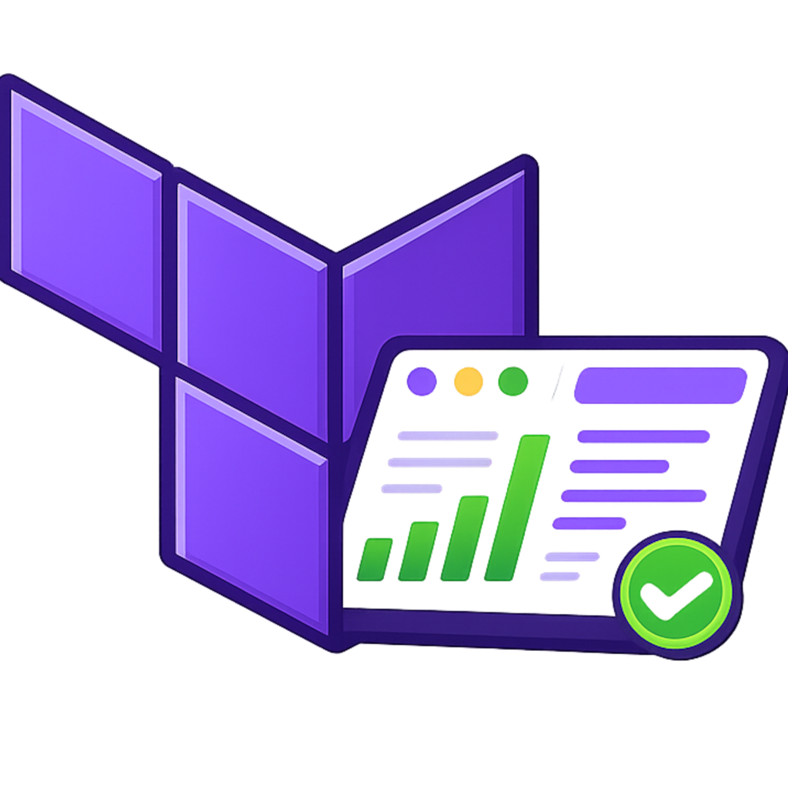

<div align="center">
  
  <h1>Terraform Graphical Manager</h1>
  <p><strong>A local, open-source Terraform Cloud-like UI for your own machines.</strong></p>
  <p>
    <a href="#-features">Features</a> ·
    <a href="#-installation">Installation</a> ·
    <a href="#%EF%B8%8F-cli">CLI</a> ·
    <a href="#-configuration">Configuration</a> ·
    <a href="#-storage-backends">Storage Backends</a> ·
    <a href="#-terraform-version-management">Version Management</a> ·
    <a href="#-rest-api">REST API</a> ·
    <a href="#-testing--linting">Testing</a> ·
    <a href="#-security">Security</a>
  </p>
</div>

---

Terraform Graphical Manager (TGM) is an open-source Python web application that provides a beautiful graphical dashboard for managing Terraform workspaces stored locally on disk.  
No cloud account required. No authentication. No internet needed. Runs entirely on your machine.

---

## ✨ Features

| Category | Capability |
|---|---|
| **Dashboard** | Workspace tree overview · Stats (workspaces, running, queued, plans, applies, errors) · Error spotlight with log snippet |
| **Workspace detail** | Provider & backend detection · Git branch/commit info · Terraform version pinning per workspace |
| **Execution** | `plan` and `apply` with real-time log streaming via Socket.IO · Concurrent execution queue · Cancelation support |
| **Plan diff** | Color-coded resource changes (create / update / delete / no-op) parsed from `plan.json` |
| **State viewer** | `terraform state pull` parsed and displayed as a navigable resource browser |
| **Drift detection** | `terraform plan -refresh-only` to detect configuration drift automatically |
| **Dependency graph** | `terraform graph` rendered interactively with D3.js (zoom, pan, click) |
| **Outputs** | `terraform output -json` displayed with sensitive values masked |
| **Git integration** | Branch, commit hash, author, message display · One-click `git pull` |
| **Version management** | Multiple local Terraform binaries organized by folder · Per-workspace version pin · Per-run override via modal |
| **Settings UI** | Visual panel to edit all `tfg.conf` settings · Backend checklist · Site name customization |
| **Storage backends** | Local filesystem · AWS S3 · GCP Cloud Storage · Azure Blob Storage |
| **Credential isolation** | Each execution runs with its own isolated environment — no credential leakage |

---

## 📋 Prerequisites

- Python **3.9+**
- **Terraform CLI** installed and in `PATH` (or configure local version binaries — see [Version Management](#-terraform-version-management))
- **Git CLI** in `PATH` (for Git integration features)
- Terraform repositories already cloned on disk

---

## 🚀 Installation

```bash
# 1. Clone the repository
git clone https://github.com/eandresr/terraform-graphical-manager.git
cd terraform-graphical-manager

# 2. Create and activate a virtual environment
python3 -m venv venv
source venv/bin/activate          # Windows: venv\Scripts\activate

# 3. Install the package and its dependencies
pip install .

# 3b. Also install dev tools (linting, auditing)
pip install ".[dev]"

# 4. Create your configuration file
cp config/tfg.conf.example tfg.conf
# Edit tfg.conf — at minimum, set repos_root to your Terraform repos directory

# 5. Launch
tgm start
```

Open **http://localhost:5005** in your browser.

> **Port** defaults to `5005`. Override with `tgm start --port 8080`.  
> **Debug mode** defaults to off. Enable with `tgm start --debug`.  
> You can still run the app directly with `python run.py [--port PORT]` if you prefer.

---

## 🖥️ CLI

After `pip install .` (or `pip install -e .` for development), the `tgm` command is available globally.

### Commands

```bash
tgm --help              # top-level help
tgm start --help        # help for the start subcommand
```

### `tgm start`

```bash
tgm start                                    # default port 5005
tgm start --port 5000                        # custom port
tgm start --port 8080 --host 127.0.0.1      # bind to localhost only
tgm start --port 5000 --debug               # enable Flask debug mode
```

| Flag | Default | Description |
|---|---|---|
| `--port PORT` | `5005` (or `$PORT`) | TCP port to listen on |
| `--host HOST` | `0.0.0.0` (or `$HOST`) | Network interface to bind to |
| `--debug` | `false` (or `$DEBUG=true`) | Enable Flask debug/reload mode |

### Environment variable fallbacks

All flags can also be set via environment variables:

```bash
export PORT=8080
export HOST=127.0.0.1
export DEBUG=true
tgm start
```

---

## ⚙️ Configuration

All settings are stored in **`tfg.conf`** (INI format) in the project root.  
You can also edit everything from the **Settings UI** at `/settings` — changes are written back to `tfg.conf` automatically.

### Full `tfg.conf` reference

```ini
[workspaces]
# Root directory containing your Terraform workspace folders.
# Accepts absolute paths or paths relative to where run.py is executed.
# Tilde (~) expansion is supported.
repos_root = ~/terraform

[ui]
# Custom name shown in the browser tab, sidebar brand, and page titles.
# Useful when multiple team members clone the project under different names.
site_name = Terraform Graphical Manager

# UI theme (currently only terraform-cloud is available)
theme = terraform-cloud

[execution]
# Maximum number of Terraform operations that may run concurrently.
max_concurrent = 3

[terraform]
# Path to a directory containing local Terraform version binaries.
# Each subdirectory must be named  major_minor_patch  (e.g. 1_5_7)
# and contain a terraform  (or terraform.exe) binary.
# Leave empty to use only the system Terraform binary.
versions_folder =

# Global default Terraform version used when a workspace has no version pinned.
# Write "system" (or leave empty) to use the binary found on PATH.
default_version = system
```

### Configuration key summary

| Key | Type | Default | Description |
|---|---|---|---|
| `workspaces.repos_root` | path | `~/terraform` | Root directory of your Terraform repositories |
| `ui.site_name` | string | `Terraform Graphical Manager` | Application name displayed in the UI |
| `ui.theme` | string | `terraform-cloud` | Visual theme |
| `execution.max_concurrent` | integer | `3` | Max parallel Terraform executions |
| `terraform.versions_folder` | path | _(empty)_ | Directory containing local Terraform binaries |
| `terraform.default_version` | string | `system` | Default Terraform version (`system` = PATH binary) |

---

## 💾 Storage Backends

Execution history, logs, and plan artefacts are **always persisted** after each run.  
By default a **local filesystem backend** is used. You can switch to a cloud backend by setting environment variables — no code changes required.

### Choosing a backend

Set the `TERRAFORM_GRAPHICAL_BACKEND` environment variable before starting the app:

| Value | Storage |
|---|---|
| _(unset)_ or `local` | Local filesystem (default) |
| `aws` | AWS S3 |
| `gcp` | GCP Cloud Storage |
| `azure` | Azure Blob Storage |

---

### 🗂️ Local filesystem (default)

```bash
# Optional — override the storage directory (default: ./TERRAFORM_GRAPHICAL_BACKEND/)
export TERRAFORM_GRAPHICAL_BACKEND_LOCAL_PATH=/data/tgm-history
```

Data is stored at `./TERRAFORM_GRAPHICAL_BACKEND/` relative to the working directory unless overridden.

---

### ☁️ AWS S3

```bash
export TERRAFORM_GRAPHICAL_BACKEND=aws
export TERRAFORM_GRAPHICAL_BACKEND_BUCKET=my-tgm-bucket
export TERRAFORM_GRAPHICAL_BACKEND_AWS_ACCESS_KEY_ID=AKIA…
export TERRAFORM_GRAPHICAL_BACKEND_AWS_SECRET_ACCESS_KEY=…
export TERRAFORM_GRAPHICAL_BACKEND_AWS_REGION=us-east-1
```

---

### ☁️ GCP Cloud Storage

```bash
export TERRAFORM_GRAPHICAL_BACKEND=gcp
export TERRAFORM_GRAPHICAL_BACKEND_BUCKET=my-tgm-bucket
export TERRAFORM_GRAPHICAL_BACKEND_GOOGLE_CREDENTIALS='{"type":"service_account",…}'
```

---

### ☁️ Azure Blob Storage

```bash
export TERRAFORM_GRAPHICAL_BACKEND=azure
export TERRAFORM_GRAPHICAL_BACKEND_CONTAINER=terraform-manager
export TERRAFORM_GRAPHICAL_BACKEND_CONNECTION_STRING="DefaultEndpointsProtocol=https;…"
```

---

### Storage structure

The on-disk layout is identical across all backends, making migration straightforward:

```
workspaces/
└── {workspace-id}/
    ├── workspace_config.json     ← per-workspace settings (terraform version pin, …)
    └── runs/
        └── {timestamp}/
            ├── metadata.json     ← id, command, status, duration, providers, …
            ├── plan.log          ← raw terraform plan output
            ├── apply.log         ← raw terraform apply output
            ├── plan.json         ← terraform show -json output
            └── tfplan.binary     ← binary plan artefact
```

> **Backend status checklist** — the Settings UI (`/settings`) shows which environment variables are set or missing for the active backend and their masked values.

---

## 🔧 Terraform Version Management

TGM lets you maintain multiple local Terraform binaries and pick the right one per workspace or per run.

### Setting up local versions

1. Create a versions folder (any path):

```
/opt/terraform-versions/
├── 1_5_7/
│   └── terraform          (must be executable)
├── 1_6_0/
│   └── terraform
└── 1_7_2/
    └── terraform
```

2. Set `terraform.versions_folder` in `tfg.conf` (or in the Settings UI) to point at that folder:

```ini
[terraform]
versions_folder = /opt/terraform-versions
default_version = 1_6_0
```

### Version selection priority

When an execution starts, the binary is resolved in this order:

```
Per-run override (modal dropdown)
        ↓
Workspace-pinned version (saved in workspace_config.json)
        ↓
Global default (terraform.default_version in tfg.conf)
        ↓
System Terraform binary (PATH)
```

### Version display format

| Context | Label shown |
|---|---|
| System binary | `1.5.7 (System Default)` |
| Local binary | `1.6.0` |

---

## 🔌 REST API

All UI features are powered by a JSON REST API. Base path: `/api/`

### Workspaces

| Method | Endpoint | Description |
|---|---|---|
| `GET` | `/api/workspaces` | List all discovered workspaces |
| `GET` | `/api/workspace/{id}` | Get workspace details |
| `GET` | `/api/workspace/{id}/credentials` | Credential status per provider |
| `GET` | `/api/workspace/{id}/executions` | List all runs for a workspace |
| `GET` | `/api/workspace/{id}/state` | `terraform state pull` parsed as JSON |
| `GET` | `/api/workspace/{id}/graph` | `terraform graph` as `{nodes, links}` for D3 |
| `GET` | `/api/workspace/{id}/drift` | Drift detection result |
| `GET` | `/api/workspace/{id}/lock` | State lock status |
| `GET` | `/api/workspace/{id}/output` | `terraform output -json` (sensitive values masked) |
| `POST` | `/api/workspace/{id}/git-pull` | Run `git pull` |
| `GET` | `/api/workspace/{id}/version` | Get pinned/effective Terraform version |
| `POST` | `/api/workspace/{id}/version` | Pin a Terraform version for the workspace |

### Executions

| Method | Endpoint | Description |
|---|---|---|
| `POST` | `/api/workspace/{id}/run` | Submit a `plan` or `apply` |
| `GET` | `/api/executions/{id}` | Get execution status |
| `GET` | `/api/executions/{id}/logs?offset=N` | Stream logs (from offset) |
| `GET` | `/api/executions/{id}/plan` | Parsed plan diff |
| `POST` | `/api/executions/{id}/cancel` | Cancel a running execution |

#### `POST /api/workspace/{id}/run` — request body

```json
{
  "command": "plan",
  "env_vars": {
    "AWS_ACCESS_KEY_ID": "AKIA…",
    "AWS_SECRET_ACCESS_KEY": "…",
    "AWS_DEFAULT_REGION": "us-east-1"
  },
  "plan_execution_id": null,
  "terraform_version_override": "1.6.0"
}
```

| Field | Type | Description |
|---|---|---|
| `command` | `"plan"` \| `"apply"` | Terraform operation |
| `env_vars` | object | Provider credentials for this run only |
| `plan_execution_id` | string \| null | For `apply` — reference an existing plan's execution ID |
| `terraform_version_override` | string | Override version for this run only (`"system"` = PATH binary) |

### Terraform Versions

| Method | Endpoint | Description |
|---|---|---|
| `GET` | `/api/versions` | List available local versions + system version |

### Settings

| Method | Endpoint | Description |
|---|---|---|
| `GET` | `/settings` | Visual settings page |
| `POST` | `/settings` | Save settings to `tfg.conf` |

---

## ⚡ Execution Queue

The application maintains an in-memory execution queue backed by Python worker threads.

```
        ┌──────────┐     ┌──────────┐     ┌──────────┐
submit  │ Worker 1 │     │ Worker 2 │     │ Worker 3 │
──────► │ running  │     │ queued   │     │ queued   │
        └──────────┘     └──────────┘     └──────────┘
              │
              ▼
        queued → running → completed
                        ↘ failed
                        ↘ canceled
```

- Default concurrency: **3** simultaneous executions (configurable via `execution.max_concurrent`)
- Each execution is isolated with its own environment variable dictionary
- Log output is streamed line-by-line to the browser via **Socket.IO**
- Users can **cancel** any queued or running execution from the UI
- Historical executions are loaded from the storage backend on demand

---

## 🔐 Security & Credential Isolation

Each Terraform execution receives a **clean, isolated environment**:

```python
# Never inherits os.environ — only explicitly provided credentials are passed
subprocess.Popen(cmd, env=isolated_env, cwd=workspace_path)
```

Key security properties:

- **No credential leakage** between concurrent executions using different accounts
- **Credentials are never persisted to disk** — they exist only in memory for the duration of the execution
- **No `shell=True`** — all subprocess calls use argument lists to prevent injection
- **Sensitive state attributes** are masked in the State Viewer
- **Sensitive Terraform outputs** are masked as `***sensitive***`

### Provider credential variables

| Provider | Required variables | Optional variables |
|---|---|---|
| **AWS** | `AWS_ACCESS_KEY_ID`, `AWS_SECRET_ACCESS_KEY` | `AWS_DEFAULT_REGION`, `AWS_SESSION_TOKEN` |
| **GCP** | `GOOGLE_CREDENTIALS` | `GOOGLE_PROJECT` |
| **Azure** | `ARM_SUBSCRIPTION_ID`, `ARM_TENANT_ID`, `ARM_CLIENT_ID`, `ARM_CLIENT_SECRET` | — |

---

## 🗂️ Project Structure

```
terraform-graphical-manager/
├── run.py                         ← direct entry point (python run.py [--port PORT])
├── pyproject.toml                 ← package metadata, dependencies, entry points
├── tfg.conf                       ← your local configuration (gitignored)
├── requirements.txt
│
├── app/
│   ├── app.py                     ← Flask app factory
│   ├── cli.py                     ← tgm CLI entry point (tgm start --port …)
│   ├── config.py                  ← tfg.conf parser (Config class)
│   ├── workspace_scanner.py       ← recursive .tf discovery → workspace tree
│   ├── provider_detector.py       ← AWS / GCP / Azure provider detection
│   ├── backend_detector.py        ← s3 / gcs / azurerm backend detection
│   ├── env_validator.py           ← credential detection + isolated env builder
│   ├── terraform_runner.py        ← subprocess Terraform integration
│   ├── execution_queue.py         ← thread-based execution queue + lifecycle
│   ├── plan_parser.py             ← plan.json resource_changes parser
│   ├── state_parser.py            ← terraform state pull parser
│   ├── version_manager.py         ← local Terraform binary discovery
│   │
│   ├── storage/
│   │   ├── __init__.py            ← backend factory (env-based selection)
│   │   ├── local_backend.py       ← local filesystem backend
│   │   ├── aws_backend.py         ← AWS S3 backend
│   │   ├── gcp_backend.py         ← GCP Cloud Storage backend
│   │   └── azure_backend.py       ← Azure Blob Storage backend
│   │
│   └── routes/
│       ├── workspace_routes.py    ← UI pages (dashboard, workspace detail)
│       ├── execution_routes.py    ← execution detail page
│       ├── api_routes.py          ← JSON REST API
│       └── settings_routes.py     ← Settings UI page
│
├── templates/
│   ├── base.html                  ← sidebar + topbar layout
│   ├── dashboard.html             ← workspace overview + stats + error spotlight
│   ├── workspace.html             ← workspace detail (Overview / Runs / State / Graph / Outputs)
│   ├── execution_modal.html       ← credential + version + confirm modal
│   ├── execution_detail.html      ← live log streaming page
│   ├── plan_diff.html             ← plan resource diff view
│   ├── state_view.html            ← Terraform state browser
│   ├── graph_view.html            ← D3.js dependency graph
│   └── settings.html              ← visual settings panel
│
├── static/
│   ├── css/main.css
│   ├── img/icon.png               ← application icon / favicon
│   └── js/
│       ├── main.js
│       └── graph.js               ← D3.js force-directed graph renderer
│
├── tests/
│   ├── conftest.py                ← shared pytest fixtures (Flask test client)
│   ├── test_config.py             ← Config class tests
│   ├── test_plan_parser.py        ← plan_parser tests
│   ├── test_state_parser.py       ← state_parser tests
│   ├── test_workspace_scanner.py  ← WorkspaceScanner tests
│   ├── test_version_manager.py    ← version_manager tests
│   ├── test_routes.py             ← Flask route tests
│   ├── test_cli.py                ← CLI entry point tests
│   └── test_run.py                ← run.py --port/--debug tests
│
└── config/
    └── tfg.conf.example           ← configuration template
```

---

## 🏗️ Architecture Overview

```
Browser (Alpine.js + TailwindCSS)
        │
        │  HTTP + Socket.IO (real-time logs)
        ▼
Flask Web Application
├── workspace_routes   → dashboard, workspace detail pages
├── execution_routes   → execution detail page
├── api_routes         → JSON REST API (consumed by Alpine.js)
└── settings_routes    → settings page (reads/writes tfg.conf)
        │
        ├── WorkspaceScanner    → recursive .tf file discovery
        ├── TerraformRunner     → subprocess: init / plan / apply / state / graph / output
        ├── ExecutionQueue      → thread pool (max_concurrent workers)
        ├── VersionManager      → local binary discovery + resolution
        └── StorageBackend      → local / S3 / GCS / Azure
                │
                ▼
        Terraform CLI (subprocess)   +   Storage (disk / cloud)
```

---

## 🧪 Testing & Linting

### Running the test suite

The project uses **pytest** with 112+ tests covering parsers, config, API routes, CLI, workspace scanner, and version manager.

```bash
# Install dev dependencies (includes pytest, flake8, pip-audit)
pip install -e ".[dev]"

# Run all tests
pytest tests/

# Run with verbose output
pytest tests/ -v

# Run a specific test file
pytest tests/test_cli.py -v
pytest tests/test_plan_parser.py -v
```

### Test coverage by module

| Test file | Module(s) covered |
|---|---|
| `tests/test_config.py` | `app/config.py` — defaults, file parsing, `save()` |
| `tests/test_plan_parser.py` | `app/plan_parser.py` — counts, sorting, diffs, metadata |
| `tests/test_state_parser.py` | `app/state_parser.py` — resources, modules, sensitive masking |
| `tests/test_workspace_scanner.py` | `app/workspace_scanner.py` — discovery, ID encoding |
| `tests/test_version_manager.py` | `app/version_manager.py` — binary discovery and resolution |
| `tests/test_routes.py` | Flask routes — dashboard, API endpoints, settings |
| `tests/test_cli.py` | `app/cli.py` — argument parsing, env vars, server launch |
| `tests/test_run.py` | `run.py` — `--port`, `--debug`, `$PORT`, `$DEBUG` |

### Linting with flake8

The project enforces **PEP 8** style with a max line length of 99 characters. Config is in `pyproject.toml`.

```bash
# Lint the entire app/ directory
flake8 --max-line-length=99 app/

# Or simply (picks up pyproject.toml config automatically)
flake8 app/
```

### Security audit

```bash
# Scan dependencies for known vulnerabilities
pip-audit
```

### Run everything in one shot

```bash
pytest tests/ -q && flake8 app/ && echo "ALL CLEAN"
```

---

## 🤝 Contributing

Contributions of all kinds are welcome — bug reports, feature requests, documentation improvements, and code.

Please read the **[Contributing Guide](CONTRIBUTING.md)** for the full workflow:

1. [Fork the repository](../../fork) and clone your fork
2. Create a feature branch from `main`: `git checkout -b feat/your-feature`
3. Make your changes following [PEP 8](https://peps.python.org/pep-0008/) style
4. Open a GitHub Issue describing the change before submitting large PRs
5. Submit a Pull Request referencing the issue with `Closes #N`

See also:

- [CODE_OF_CONDUCT.md](CODE_OF_CONDUCT.md) — community standards
- [SECURITY.md](SECURITY.md) — responsible disclosure and security model
- [.github/pull_request_template.md](.github/pull_request_template.md) — PR checklist

---

## 📄 License

[MIT](LICENSE)


---

## Overview

Terraform Graphical Manager (TGM) is an open-source Python web application that provides a Terraform Cloud-like graphical dashboard for managing Terraform workspaces stored locally on disk. It requires no remote connection, no authentication, and runs entirely on your machine.

It discovers workspaces automatically, detects providers and backends, executes real Terraform commands (`init`, `plan`, `apply`), streams logs in real-time, visualizes plan diffs, inspects state, detects drift, renders dependency graphs, and stores execution history in cloud storage of your choice (AWS S3, GCP GCS, or Azure Blob).

---

## Architecture

```
┌──────────────────────────────────────────────────────────────┐
│                     Flask Web Application                    │
│                                                              │
│  ┌────────────────┐  ┌────────────────┐  ┌───────────────┐  │
│  │ workspace_     │  │ execution_     │  │  api_routes   │  │
│  │ routes.py      │  │ routes.py      │  │               │  │
│  └────────────────┘  └────────────────┘  └───────────────┘  │
│                                                              │
│  ┌──────────────────────────────────────────────────────┐    │
│  │                   Execution Queue                    │    │
│  │   ┌───────────┐  ┌───────────┐  ┌───────────┐       │    │
│  │   │  Worker 1 │  │  Worker 2 │  │  Worker 3 │       │    │
│  │   └───────────┘  └───────────┘  └───────────┘       │    │
│  └──────────────────────────────────────────────────────┘    │
│                                                              │
│  ┌────────────────┐  ┌────────────────┐  ┌───────────────┐  │
│  │ workspace_     │  │ terraform_     │  │   storage/    │  │
│  │ scanner.py     │  │ runner.py      │  │  (S3/GCS/AZ)  │  │
│  └────────────────┘  └────────────────┘  └───────────────┘  │
│                                                              │
│  ┌────────────┐  ┌───────────────┐  ┌────────────────────┐  │
│  │ plan_      │  │ state_        │  │  env_validator.py  │  │
│  │ parser.py  │  │ parser.py     │  │                    │  │
│  └────────────┘  └───────────────┘  └────────────────────┘  │
└──────────────────────────────────────────────────────────────┘
         │                   │
         ▼                   ▼
  Terraform CLI         Cloud Storage
  (subprocess)       (S3 / GCS / Azure)
```

---

## Project File Structure

```
terraform-graphical-manager/
├── README.md
├── requirements.txt
├── run.py
├── tfg.conf                    ← create from config/tfg.conf.example
│
├── app/
│   ├── __init__.py
│   ├── app.py                  ← Flask app factory
│   ├── config.py               ← tfg.conf parser
│   ├── workspace_scanner.py    ← recursive .tf discovery
│   ├── provider_detector.py    ← AWS / GCP / Azure provider detection
│   ├── backend_detector.py     ← s3 / gcs / azurerm backend detection
│   ├── env_validator.py        ← credential detection + validation
│   ├── terraform_runner.py     ← subprocess terraform integration
│   ├── execution_queue.py      ← thread-based execution queue
│   ├── plan_parser.py          ← plan.json resource_changes parser
│   ├── state_parser.py         ← terraform state pull parser
│   │
│   ├── storage/
│   │   ├── __init__.py         ← backend factory
│   │   ├── aws_backend.py      ← S3 storage
│   │   ├── gcp_backend.py      ← GCS storage
│   │   └── azure_backend.py    ← Azure Blob storage
│   │
│   └── routes/
│       ├── __init__.py
│       ├── workspace_routes.py ← UI page routes
│       ├── execution_routes.py ← execution management routes
│       └── api_routes.py       ← JSON REST API routes
│
├── templates/
│   ├── base.html               ← sidebar + topbar layout
│   ├── dashboard.html          ← workspace tree overview
│   ├── workspace.html          ← workspace detail + tabs
│   ├── execution_modal.html    ← credential + confirm modal
│   ├── plan_diff.html          ← plan resource diff view
│   ├── state_view.html         ← terraform state browser
│   └── graph_view.html         ← D3.js dependency graph
│
├── static/
│   ├── css/
│   │   └── main.css
│   └── js/
│       ├── main.js
│       └── graph.js            ← D3.js graph renderer
│
└── config/
    └── tfg.conf.example
```

---

## Installation

### Prerequisites

- Python 3.11+
- Terraform CLI installed and in `PATH`
- Git CLI installed and in `PATH`
- Terraform repositories already cloned on disk

### Steps

```bash
# Clone the repository
git clone https://github.com/your-org/terraform-graphical-manager
cd terraform-graphical-manager

# Create and activate a virtual environment
python3 -m venv .venv
source .venv/bin/activate

# Install the package
pip install .

# Create your configuration file
cp config/tfg.conf.example tfg.conf
# Edit tfg.conf and set repos_root to your Terraform repos directory

# Run the application
python run.py
```

Open your browser at `http://localhost:5000`.

---

## Configuration

Edit `tfg.conf`:

```ini
[workspaces]
repos_root=/data/terraform/repos

[ui]
theme=terraform-cloud

[execution]
max_concurrent=3
```

| Key | Description | Default |
|-----|-------------|---------|
| `workspaces.repos_root` | Root directory containing Terraform repos | `~/terraform` |
| `ui.theme` | UI theme name | `terraform-cloud` |
| `execution.max_concurrent` | Max parallel Terraform executions | `3` |

---

## Cloud Storage Backend

Execution history and logs are always persisted. By default, when no cloud
backend is configured, a **local filesystem backend** is used — data is
stored in a directory called `TERRAFORM_GRAPHICAL_BACKEND/` inside the
project root (or the path set via `TERRAFORM_GRAPHICAL_BACKEND_LOCAL_PATH`).

The on-disk layout is identical to the cloud backends, so migrating to S3/GCS/Azure
is as simple as uploading the folder contents and pointing the environment variables
at the new destination:

```bash
# Explicit local backend (or just unset the variable — same result)
export TERRAFORM_GRAPHICAL_BACKEND=local

# Override storage directory (optional)
export TERRAFORM_GRAPHICAL_BACKEND_LOCAL_PATH=/data/tgm-history
```

### AWS S3

```bash
export TERRAFORM_GRAPHICAL_BACKEND=aws
export TERRAFORM_GRAPHICAL_BACKEND_BUCKET=my-tf-manager-bucket
export TERRAFORM_GRAPHICAL_BACKEND_AWS_ACCESS_KEY_ID=AKIA...
export TERRAFORM_GRAPHICAL_BACKEND_AWS_SECRET_ACCESS_KEY=...
export TERRAFORM_GRAPHICAL_BACKEND_AWS_REGION=us-east-1
```

### GCP GCS

```bash
export TERRAFORM_GRAPHICAL_BACKEND=gcp
export TERRAFORM_GRAPHICAL_BACKEND_BUCKET=my-tf-manager-bucket
export TERRAFORM_GRAPHICAL_BACKEND_GOOGLE_CREDENTIALS='{"type":"service_account",...}'
```

### Azure Blob

```bash
export TERRAFORM_GRAPHICAL_BACKEND=azure
export TERRAFORM_GRAPHICAL_BACKEND_CONTAINER=terraform-manager
export TERRAFORM_GRAPHICAL_BACKEND_CONNECTION_STRING="DefaultEndpointsProtocol=https;..."
```

### Storage Structure

```
workspaces/
└── {workspace-name}/
    └── runs/
        └── {timestamp}/
            ├── metadata.json
            ├── plan.log
            ├── apply.log
            ├── plan.json
            └── tfplan.binary
```

---

## Execution Queue

The application maintains a local in-memory execution queue backed by Python worker threads.

- **Default concurrency**: 3 simultaneous executions
- Each execution is isolated with its own environment variable dictionary
- Executions pass through states: `queued → running → completed / failed / canceled`
- Log output is streamed in real-time via Socket.IO WebSocket
- Users can cancel a running execution from the UI

### Why a Queue?

Multiple workspaces may need to run `plan` or `apply` at the same time. A queue prevents resource contention and ensures proper state file locking semantics.

---

## Credential Isolation

Each Terraform execution receives its own environment dictionary built from:

1. A clean base (no host environment variables by default)
2. Only the credentials the user configures per execution in the credential modal

This prevents credential leakage between concurrent executions that use different AWS/GCP/Azure accounts.

```python
# subprocess called with explicit env dict, never inheriting os.environ
subprocess.Popen(cmd, env=isolated_env, cwd=workspace_path)
```

---

## Plan Visualization

After `terraform plan`, the tool runs:

```bash
terraform show -json tfplan.binary > plan.json
```

The `plan.json` is parsed and resource changes are displayed in a color-coded diff:

| Action | Color |
|--------|-------|
| `create` | Green |
| `update` | Yellow |
| `delete` | Red |
| `no-op` | Gray |

---

## State Viewer

`terraform state pull` is executed and the JSON output is parsed to display:

- Resource list with type, name, module
- Per-resource attributes (sensitive attributes hidden)
- Module hierarchy navigation

---

## Drift Detection

Drift detection runs `terraform plan -refresh-only -json` and checks whether any changes are detected. If drift is found, the workspace card shows a **DRIFT DETECTED** indicator in the sidebar and overview.

---

## Dependency Graph

`terraform graph` outputs DOT format. The application:

1. Parses the DOT graph
2. Converts nodes/edges to JSON
3. Renders with D3.js force-directed layout
4. Supports zoom, pan, and node click to inspect resource details

---

## Git Integration

Each workspace directory is expected to be a Git repository. The application:

- Detects current branch, last commit hash, author, and message
- Displays this information in the workspace overview
- Provides a **Pull latest changes** button that runs `git pull`

---

## Security Notes

- All Terraform commands are invoked via `subprocess` with a list of arguments (no `shell=True`)
- Workspace paths are validated to be within `repos_root` (path traversal prevention)
- Credentials entered in the modal are never persisted to disk; they exist only in memory for the duration of the execution
- Sensitive state attributes are masked in the UI

---

## License

MIT License
