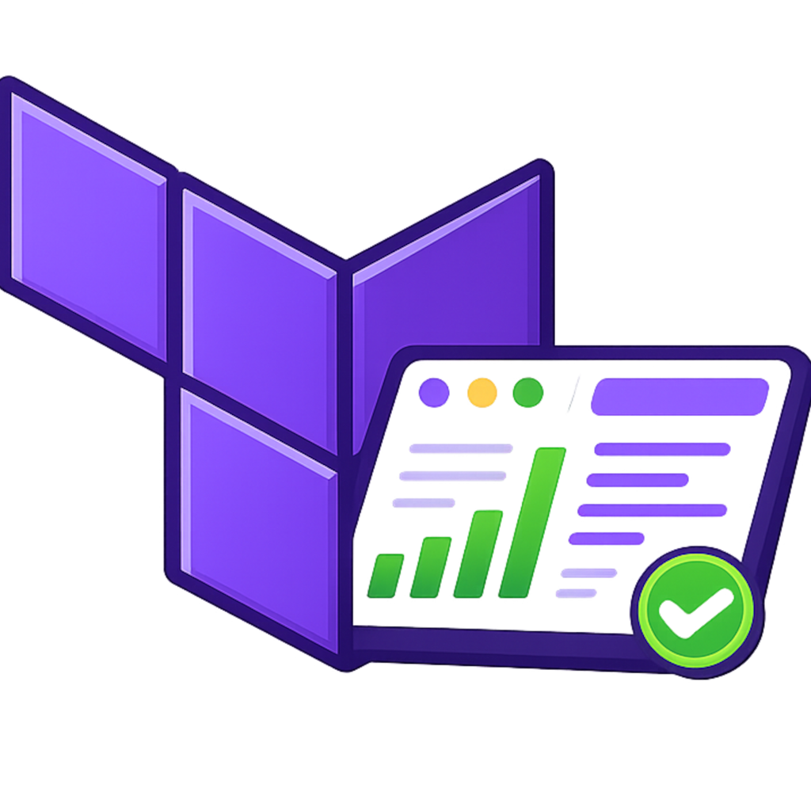

<div align="center">
  
  <h1>Terraform Graphical Manager</h1>
  <p><strong>A local, open-source Terraform Cloud-like UI for your own machines.</strong></p>
  <p>
    <a href="#-features">Features</a> ·
    <a href="#-installation">Installation</a> ·
    <a href="#%EF%B8%8F-cli">CLI</a> ·
    <a href="#%EF%B8%8F-configuration">Configuration</a> ·
    <a href="#-storage-backends">Storage Backends</a> ·
    <a href="#-terraform-version-management">Version Management</a> ·
    <a href="#-variable-groups">Variable Groups</a> ·
    <a href="#-workspace-variables">Workspace Variables</a> ·
    <a href="#-portal-security">Portal Security</a> ·
    <a href="#-hashicorp-vault">HashiCorp Vault</a> ·
    <a href="#-metrics-export">Metrics Export</a> ·
    <a href="#-notification-channels">Notifications</a> ·
    <a href="#-automation-workflows">Automation Workflows</a> ·
    <a href="#%EF%B8%8F-backend-configuration-ui">Backend Config UI</a> ·
    <a href="#-api-management-panel">API Management</a> ·
    <a href="#-rest-api">REST API</a> ·
    <a href="#-testing--linting">Testing</a> ·
    <a href="#-security">Security</a>
  </p>
</div>

---

Terraform Graphical Manager (TGM) is an open-source Python web application that provides a beautiful graphical dashboard for managing Terraform workspaces stored locally on disk.  
No cloud account required. No authentication. No internet needed. Runs entirely on your machine.

---

## ✨ Features

| Category | Capability |
|---|---|
| **Dashboard** | Workspace tree overview · Stats (workspaces, running, queued, plans, applies, errors) · Error spotlight with log snippet |
| **Workspace detail** | Provider & backend detection · Git branch/commit info · Terraform version pinning per workspace |
| **Execution** | `plan` and `apply` with real-time log streaming via Socket.IO · Concurrent execution queue · Cancelation support |
| **Plan diff** | Color-coded resource changes (create / update / delete / no-op) parsed from `plan.json` |
| **State viewer** | `terraform state pull` parsed and displayed as a navigable resource browser |
| **Drift detection** | `terraform plan -refresh-only` to detect configuration drift automatically |
| **Dependency graph** | `terraform graph` rendered interactively with D3.js (zoom, pan, click) |
| **Outputs** | `terraform output -json` displayed with sensitive values masked |
| **Git integration** | Branch / tag / release selector with search · Local & remote ref listing · One-click checkout (fetches remote branches automatically) · `git fetch` button · Optional `git pull` before each run · PAT token resolution (env var → workspace var → group var) · Run labels showing git ref and pull status |
| **Version management** | Multiple local Terraform binaries · dot (`1.14.8`) or underscore (`1_14_8`) folder names · Per-workspace version pin · Per-run override |
| **Workspace discovery** | Recursive `.tf` scanner · Group folders rendered as collapsible tree · Sidebar search filter · Subdirectories of a workspace are never treated as separate workspaces |
| **Variable Groups** | Named sets of Terraform/env variables applied to one or more workspaces · global or workspace-scoped · Dedicated **sidebar panel** (accessible from any page) with create/edit/delete + "Used in" workspace viewer |
| **Workspace Variables** | Individual key-value variables scoped to a single workspace · Stored in `workspace_config.json` · Injected on every run |
| **Portal Security** | Optional password lock · Fernet-based encryption of sensitive variable values · Auto re-encryption when password changes · Safe "remove lock" modal with option to decrypt values to plaintext |
| **HashiCorp Vault** | Optional external secrets backend · Stores all sensitive values in Vault KV-v2 · `vault:` reference scheme · Covers variable groups, workspace vars, backend credentials, notification secrets, and metrics tokens · Bidirectional one-click migration (to Vault / from Vault) · UI panel in Settings |
| **Settings UI** | Visual panel to edit all `tfg.conf` settings · **Sticky in-page navigation sidebar** with 8 sections · Backend checklist · Site name customization |
| **Storage backends** | Local filesystem · AWS S3 · GCP Cloud Storage · Azure Blob Storage |
| **Credential isolation** | Each execution runs with its own isolated environment — no credential leakage |
| **Execution statistics** | Per-workspace run history charts (duration trend, resource-change counts) rendered with Chart.js in the Overview tab |
| **Metrics export** | Push execution metrics to InfluxDB v2, Prometheus Pushgateway, or Graphite after every run · Per-workspace opt-in toggle · Configurable prefix |
| **Notification channels** | Alert Slack, Microsoft Teams, Email/SMTP, PagerDuty, or Prometheus Alertmanager when runs finish · Global or workspace-scoped channels · Dedicated **sidebar panel** for global channel management · Configurable triggers (success / failure / Sentinel fail) · Customisable prefix and body templates with variable substitution |
| **Automation Workflows** | Per-workspace workflows triggered after plan/apply · 4 built-in types: Script, API (Token), Rundeck Job, Jenkins Job · Template variables (`{{ var.* }}`, `{{ env.* }}`, `{{ run.* }}`) · Secrets encrypted at rest (Fernet/Vault) · Plugin extension API · Results stored in run history with colour-coded labels |
| **Backend Config UI** | Configure AWS S3, GCP Cloud Storage, Azure Blob Storage, or local backend directly from Settings · Credentials encrypted at rest (Fernet) · Connectivity test with write/read/delete probe · AWS STS assume-role support · **Manual diff+migrate panel**: compare local vs cloud object counts and migrate in one click · One-click source data deletion after migration |
| **API Management Panel** | Interactive REST API documentation and live client at `/api-docs` · Swagger-style colour-coded endpoint cards (GET / POST / PUT / DELETE) · Live try-it panel with path/query/body inputs · Authentication section with Bearer-token auto-retrieval when portal lock is enabled · Filter by method or text · Response viewer with copy button |

---

## 🎬 Quick Preview

Want to try TGM without touching your real Terraform repos or writing any config?
**`tgm preview`** spins up a fully working demo in seconds — no setup required.

```bash
# Install the package (once)
pip install .

# Launch the demo
tgm preview
```

This command:

1. Creates a **temporary directory** (auto-deleted on exit) containing:
   - `conf/` — a ready-to-use `tfg.conf` pointing at the bundled examples
   - `workspaces/` — a copy of the 15+ example Terraform workspaces shipped with the project
   - `sentinel/` — a copy of the bundled Sentinel policy sets (cost, networking, security, tagging)
2. Starts the web server and opens **http://localhost:5005** with the demo data pre-loaded.
3. Cleans up the temp directory automatically when you stop the server (`Ctrl-C`).

> Nothing is written to your home directory or project folder.
> All execution history created during the preview lives only in the temp dir.

### Preview flags

```bash
tgm preview                                  # default port 5005
tgm preview --port 8080                      # custom port
tgm preview --host 127.0.0.1 --port 5000    # bind to localhost only
tgm preview --debug                          # enable Flask debug mode
```

| Flag | Default | Description |
|---|---|---|
| `--port PORT` | `5005` | TCP port to listen on |
| `--host HOST` | `0.0.0.0` | Network interface to bind to |
| `--debug` | `false` | Enable Flask debug / auto-reload mode |

---

## 📋 Prerequisites

- Python **3.9+**
- **Terraform CLI** installed and in `PATH` (or configure local version binaries — see [Version Management](#-terraform-version-management))
- **Git CLI** in `PATH` (for Git integration features)
- Terraform repositories already cloned on disk

---

## 🚀 Installation

```bash
# 1. Clone the repository
git clone https://github.com/eandresr/terraform-graphical-manager.git
cd terraform-graphical-manager

# 2. Create and activate a virtual environment
python3 -m venv venv
source venv/bin/activate          # Windows: venv\Scripts\activate

# 3. Install the package and its dependencies
pip install .

# 3b. Also install dev tools (linting, auditing)
pip install ".[dev]"

# 4. Create your configuration file
cp config/tfg.conf.example tfg.conf
# Edit tfg.conf — at minimum, set repos_root to your Terraform repos directory

# 5. Launch
tgm start
```

Open **http://localhost:5005** in your browser.

> **Port** defaults to `5005`. Override with `tgm start --port 8080`.  
> **Debug mode** defaults to off. Enable with `tgm start --debug`.  
> You can still run the app directly with `python run.py [--port PORT]` if you prefer.

---

## 🖥️ CLI

After `pip install .` (or `pip install -e .` for development), the `tgm` command is available globally.

### Commands

```bash
tgm --help              # top-level help
tgm start --help        # help for the start subcommand
```

### `tgm preview`

Launch a zero-config live demo using the bundled example workspaces and Sentinel policies.
A temporary directory is created for the duration of the session and removed on exit.

```bash
tgm preview                 # demo on http://localhost:5005
tgm preview --port 8080    # custom port
tgm preview --debug        # debug mode
```

See [Quick Preview](#-quick-preview) for full details.

### `tgm start`

```bash
tgm start                                    # default port 5005
tgm start --port 5000                        # custom port
tgm start --port 8080 --host 127.0.0.1      # bind to localhost only
tgm start --port 5000 --debug               # enable Flask debug mode
```

| Flag | Default | Description |
|---|---|---|
| `--port PORT` | `5005` (or `$PORT`) | TCP port to listen on |
| `--host HOST` | `0.0.0.0` (or `$HOST`) | Network interface to bind to |
| `--debug` | `false` (or `$DEBUG=true`) | Enable Flask debug/reload mode |

### Environment variable fallbacks

All flags can also be set via environment variables:

```bash
export PORT=8080
export HOST=127.0.0.1
export DEBUG=true
tgm start
```

---

## ⚙️ Configuration

All settings are stored in **`tfg.conf`** (INI format) in the project root.  
You can also edit everything from the **Settings UI** at `/settings` — changes are written back to `tfg.conf` automatically.

### Full `tfg.conf` reference

```ini
[workspaces]
# Root directory containing your Terraform workspace folders.
# Accepts absolute paths or paths relative to where run.py is executed.
# Tilde (~) expansion is supported.
repos_root = ~/terraform

[ui]
# Custom name shown in the browser tab, sidebar brand, and page titles.
# Useful when multiple team members clone the project under different names.
site_name = Terraform Graphical Manager

# UI theme (currently only terraform-cloud is available)
theme = terraform-cloud

[execution]
# Maximum number of Terraform operations that may run concurrently.
max_concurrent = 3

[terraform]
# Path to a directory containing local Terraform version binaries.
# Subdirectory names can use dots (1.14.8) or underscores (1_14_8).
# Each subdirectory must contain a terraform (or terraform.exe) binary.
# Leave empty to use only the system Terraform binary.
versions_folder =

# Global default Terraform version used when a workspace has no version pinned.
# Write "system" (or leave empty) to use the binary found on PATH.
default_version = system
```

### Configuration key summary

| Key | Type | Default | Description |
|---|---|---|---|
| `workspaces.repos_root` | path | `~/terraform` | Root directory of your Terraform repositories |
| `ui.site_name` | string | `Terraform Graphical Manager` | Application name displayed in the UI |
| `ui.theme` | string | `terraform-cloud` | Visual theme |
| `execution.max_concurrent` | integer | `3` | Max parallel Terraform executions |
| `terraform.versions_folder` | path | _(empty)_ | Directory containing local Terraform binaries (dot or underscore folder names) |
| `terraform.default_version` | string | `system` | Default Terraform version (`system` = PATH binary) |

---

## 💾 Storage Backends

Execution history, logs, and plan artefacts are **always persisted** after each run.  
By default a **local filesystem backend** is used. You can switch to a cloud backend by setting environment variables — no code changes required.

### Choosing a backend

Set the `TERRAFORM_GRAPHICAL_BACKEND` environment variable before starting the app:

| Value | Storage |
|---|---|
| _(unset)_ or `local` | Local filesystem (default) |
| `aws` | AWS S3 |
| `gcp` | GCP Cloud Storage |
| `azure` | Azure Blob Storage |

---

### 🗂️ Local filesystem (default)

```bash
# Optional — override the storage directory (default: ./TERRAFORM_GRAPHICAL_BACKEND/)
export TERRAFORM_GRAPHICAL_BACKEND_LOCAL_PATH=/data/tgm-history
```

Data is stored at `./TERRAFORM_GRAPHICAL_BACKEND/` relative to the working directory unless overridden.

---

### ☁️ AWS S3

```bash
export TERRAFORM_GRAPHICAL_BACKEND=aws
export TERRAFORM_GRAPHICAL_BACKEND_BUCKET=my-tgm-bucket
export TERRAFORM_GRAPHICAL_BACKEND_AWS_ACCESS_KEY_ID=AKIA…
export TERRAFORM_GRAPHICAL_BACKEND_AWS_SECRET_ACCESS_KEY=…
export TERRAFORM_GRAPHICAL_BACKEND_AWS_REGION=us-east-1
```

---

### ☁️ GCP Cloud Storage

```bash
export TERRAFORM_GRAPHICAL_BACKEND=gcp
export TERRAFORM_GRAPHICAL_BACKEND_BUCKET=my-tgm-bucket
export TERRAFORM_GRAPHICAL_BACKEND_GOOGLE_CREDENTIALS='{"type":"service_account",…}'
```

---

### ☁️ Azure Blob Storage

```bash
export TERRAFORM_GRAPHICAL_BACKEND=azure
export TERRAFORM_GRAPHICAL_BACKEND_CONTAINER=terraform-manager
export TERRAFORM_GRAPHICAL_BACKEND_CONNECTION_STRING="DefaultEndpointsProtocol=https;…"
```

---

### Storage structure

The on-disk layout is identical across all backends, making migration straightforward:

```
workspaces/
└── {workspace-id}/
    ├── workspace_config.json     ← per-workspace settings (terraform version pin, …)
    └── runs/
        └── {timestamp}/
            ├── metadata.json     ← id, command, status, duration, providers, …
            ├── plan.log          ← raw terraform plan output
            ├── apply.log         ← raw terraform apply output
            ├── plan.json         ← terraform show -json output
            └── tfplan.binary     ← binary plan artefact
```

> **Backend status checklist** — the Settings UI (`/settings`) shows which environment variables are set or missing for the active backend and their masked values.

---

### ⚙️ Configuring via the Settings UI

Instead of setting environment variables, you can configure and manage the storage backend entirely from **Settings → Storage Backend** in the TGM web interface.

#### How it works

1. Open **Settings → Storage Backend**.
2. Select the backend type (Local / AWS S3 / GCP Cloud Storage / Azure).
3. Fill in the connection details (bucket/container, region, credentials, optional prefix, etc.).
4. Click **Test connectivity** — TGM performs a write-read-delete probe to verify access.
5. Click **Save backend config** to persist the settings.

Credentials are encrypted at rest using Fernet (same algorithm as variable groups) and stored in the `[backend_credentials]` section of `tfg.conf`.

> **Priority rule:** if `TERRAFORM_GRAPHICAL_BACKEND` is set as an environment variable it takes precedence over the UI-saved configuration. The Settings page displays a warning badge when an env-var override is active.

#### AWS — STS assume-role support

Fill in the **STS role ARN** field to have TGM call `sts:AssumeRole` before every operation. The temporary session credentials are injected automatically and never stored.

#### Backend resolution order

```
TERRAFORM_GRAPHICAL_BACKEND env var
        ↓  (if unset)
[backend_credentials].type in tfg.conf  (saved via Settings UI)
        ↓  (if absent)
local  (default)
```

#### Data migration

TGM provides two ways to migrate data between storage backends:

**Automatic migration modal** — when you switch to a different backend type and save, TGM detects existing data in the current backend and opens a confirmation modal offering to copy the data.

**Manual "Migrate local data → cloud" panel** — a permanent section in **Settings → Storage Backend**, visible whenever a cloud backend is configured. This panel lets you:

1. **Load diff** — compares object counts between the local backend and the configured cloud backend, showing how many variable groups, notification channels, and execution records exist **only in local** (and haven't been migrated yet). Items missing from the destination are listed by name.
2. **Migrate now** — copies all objects that exist locally but not in the cloud backend. Progress and the final count are shown inline.
3. **Delete local source data** — appears after a successful migration with a confirmation prompt, allowing you to clean up the local storage once data is safely on the cloud backend.

All migration operations exclude binary plan artefacts (`.binary` files) which can be regenerated by running `plan` again; JSON records, logs, and configuration files are always copied.

> A portal password must be set (Settings → Portal Security) before configuring credentials for cloud backends. Credentials are encrypted using the same key as sensitive variable values.

---

## 🔧 Terraform Version Management

TGM lets you maintain multiple local Terraform binaries and pick the right one per workspace or per run.

### Setting up local versions

1. Create a versions folder and place each binary inside a subdirectory named after its version.

TGM accepts **both** naming conventions — dots (recommended) or underscores (legacy):

```
/opt/terraform/              ← versions_folder
├── 1.14.8/                  ← dot format  ✓  (recommended)
│   └── terraform
├── 1.13.5/
│   └── terraform
├── 1.12.2/
│   └── terraform
├── 1.11.4/
│   └── terraform
└── 1.10.5/
    └── terraform
```

The legacy underscore format also works:

```
/opt/terraform-versions/     ← versions_folder
├── 1_5_7/                   ← underscore format  ✓
│   └── terraform
└── 1_6_0/
    └── terraform
```

2. Set `terraform.versions_folder` in `tfg.conf` (or in the Settings UI) to point at that folder:

```ini
[terraform]
versions_folder = /opt/terraform
default_version = 1.14.8
```

### Version selection priority

When an execution starts, the binary is resolved in this order:

```
Per-run override (modal dropdown)
        ↓
Workspace-pinned version (saved in workspace_config.json)
        ↓
Global default (terraform.default_version in tfg.conf)
        ↓
System Terraform binary (PATH)
```

### Version display format

| Context | Label shown |
|---|---|
| System binary | `1.5.7 (System Default)` |
| Local binary | `1.6.0` |

### Workspace discovery rules

The scanner walks `repos_root` recursively and treats a directory as a **workspace** as soon as it finds at least one `.tf` file inside it. Subdirectories of that workspace are **not** scanned further — this means modules, child modules, and helper directories inside a workspace root are correctly ignored as separate workspaces.

Example with a `group1/` prefix folder:

```
repos_root/
├── standalone-infra/        ← workspace  (contains main.tf)
│   └── modules/             ← ignored    (subdirectory of workspace)
│       └── vpc/
└── group1/                  ← group folder (no .tf at this level)
    ├── networking/          ← workspace  (contains main.tf)
    └── compute/             ← workspace  (contains main.tf)
```

The sidebar renders group folders as collapsible nodes and workspace leaves as links.

---

## 📦 Variable Groups

Variable Groups are named, reusable sets of Terraform and environment variables that can be applied to one or more workspaces.

### Accessing Variable Groups

The **Variable Groups** entry in the sidebar (visible from every page, below the workspace list) opens the dedicated Variable Groups management page. From there you can:

- **Create** a new group (name, description, scope, variables)
- **Edit** an existing group — rename, change scope, add/remove/modify variables
- **Delete** a group
- **View which workspaces use it** — the "Used in" button (visible when a group is expanded) shows a modal with every workspace the group is assigned to, with a direct link to open each workspace

Variable Groups can also be managed per-workspace from the **Variables** tab → **Variable Groups** sub-tab inside each workspace detail view.

### Variable types

| Type | Behaviour |
|---|---|
| `TF_VAR_*` | Injected as `TF_VAR_<key>=<value>` — available to Terraform as input variables |
| `env` | Injected as `<key>=<value>` — available as environment variables to any process |

### Group scope

| Scope | Behaviour |
|---|---|
| **Global** (`workspace_ids = ["*"]`) | Applied to every workspace automatically |
| **Workspace-specific** | Applied only to the workspaces explicitly assigned |

Workspace-scoped groups **override** global groups when the same key is defined in both.

### Assigning groups to a workspace

Inside a workspace, go to the **Variables** tab → **Variable Groups** sub-tab. There you can:

- **Assign an existing group** to this workspace
- **Create a new group** scoped to this workspace
- **Edit or unassign** groups directly from the workspace view

### Sensitive variables in groups

A portal password must be configured (Settings → Portal Security) before marking any variable as sensitive. Sensitive values are encrypted at rest using Fernet symmetric encryption derived from the portal password.

> **Warning shown at creation time:** if the portal password is later removed, sensitive variables will no longer be available for runs unless they are converted to plaintext first.

---

## 🔑 Workspace Variables

In addition to Variable Groups, each workspace can have its own set of **individual variables** stored independently in `workspace_config.json`.

These are managed from the **Variables** tab → **Variables** sub-tab in the workspace detail view.

### Features

- Inline table editor — add, edit, and delete variables without leaving the tab
- Same two types: `TF_VAR_*` (Terraform input) and `env` (environment)
- **Sensitive flag** — encrypts the value at rest using the portal password; when editing an existing sensitive variable, leaving the value field blank preserves the stored encrypted value without overwriting it
- **Save variables** button persists changes immediately

### Storage

Workspace variables are stored inside `workspace_config.json` in the workspace's storage directory. They are loaded and injected on every execution of that workspace, in addition to any variables coming from assigned Variable Groups.

### REST API

| Method | Endpoint | Description |
|---|---|---|
| `GET` | `/api/workspace/{id}/vars` | Get all variables for the workspace (sensitive values masked) |
| `PUT` | `/api/workspace/{id}/vars` | Save variables (sensitive values are encrypted; omitting a value preserves the existing encrypted blob) |

---

## 🏛️ HashiCorp Vault

TGM can use a **HashiCorp Vault** server as an optional external secrets backend.
When enabled, sensitive values that would normally be Fernet-encrypted in `tfg.conf`
or JSON storage files are written to Vault's KV-v2 engine and replaced with
`vault:kv/path/to/secret#field` references. TGM resolves them transparently at runtime.

### What is stored in Vault

| Category | Vault path pattern |
|---|---|
| Variable group sensitive vars | `{mount}/tgm/variable-groups/{group-id}/{var-name}` |
| Workspace variable sensitive vars | `{mount}/tgm/workspaces/{workspace-id}/{var-name}` |
| Storage backend credentials | `{mount}/tgm/backend-credentials/{field}` |
| Notification channel secrets | `{mount}/tgm/notification-channels/{channel-id}/{field}` |
| Metrics export tokens/passwords | `{mount}/tgm/metrics/{field}` |

### Enabling Vault

1. Open **Settings → HashiCorp Vault**.
2. Enter your Vault **address**, **token**, **KV-v2 mount** (default: `secret`), and
   optionally a **namespace** (Vault Enterprise).
3. Click **Test connection** to verify connectivity.
4. Toggle **Enable Vault secrets backend** and save (requires a portal password).

> A portal password must be set before Vault can be enabled — the portal password
> is used to encrypt the Vault token at rest in `tfg.conf`.

### Migration

**Migrate to Vault** — reads all existing Fernet-encrypted values from `tfg.conf` and
backed storage files, writes them to Vault, and replaces the originals with `vault:` refs.
A styled confirmation modal lists the scope before the operation runs.

**Migrate from Vault** — reads all `vault:` references, fetches the plaintext from Vault,
re-encrypts with Fernet, and removes the secrets from Vault.

Both operations are atomic per-resource and report counts of migrated / skipped items.

### Credential handling during password change

When the portal password is changed, the re-encryption pass detects and skips `vault:` refs
(there is nothing to re-encrypt — the secret lives in Vault). Only Fernet blobs are moved
to the new key.

### Vault resolution order

```
Vault disabled → Fernet-encrypted blob (`enc:…`) or plaintext
Vault enabled  → `vault:` reference resolved via hvac client at call time
```

---

## 🔐 Portal Security

### Enabling the portal lock

Set a password in **Settings → Portal Security**. Once set:

- All pages require authentication before access
- Sensitive variable values are encrypted using a key derived from the portal password
- The session stores the encryption key for the lifetime of the browser session

### Changing the password

When you update the portal password, TGM automatically **re-encrypts all existing sensitive variables** across all groups and workspaces using the new key — no data is lost.

### Removing the portal lock

Clicking **Remove lock** opens a confirmation modal that:

1. **Lists all sensitive variables** that will become unavailable — shown as `folder → workspace → group → variable`
2. Offers an opt-in checkbox: **"Decrypt and store values as plain text"** — if checked, all sensitive variables are decrypted before the password is removed so they remain usable in future runs
3. If the checkbox is left unchecked, sensitive variables are preserved as encrypted blobs in storage but will no longer be injectable (the decryption key is gone with the password)

> **Recommendation:** if you intend to keep using your existing sensitive variables after removing the lock, enable "Decrypt and store values as plain text" before confirming.

### Encryption details

| Property | Detail |
|---|---|
| Algorithm | Fernet (AES-128-CBC + HMAC-SHA256) |
| Key derivation | SHA-256 of the plaintext password → URL-safe base64 |
| Storage | Encrypted blobs stored as strings inside the backend (`variable_groups/*.json` and `workspace_config.json`) |
| Session | The plaintext password is stored in a signed Flask session cookie as `tgm_enc_key`; it is cleared on logout |

---

## 🛡️ Sentinel Policy Integration

TGM integrates with the [HashiCorp Sentinel](https://developer.hashicorp.com/sentinel) policy-as-code framework.  
Sentinel policies are evaluated against `terraform plan` output before an apply is allowed.

### Policy set layout

Each **policy set** is a directory containing one or more `.sentinel` policy files and an optional `sentinel.hcl` configuration:

```
/opt/sentinel-policies/
├── base-compliance/
│   ├── require-tags.sentinel
│   ├── no-public-s3.sentinel
│   └── sentinel.hcl          ← optional enforcement config
└── network-rules/
    └── restrict-regions.sentinel
```

`sentinel.hcl` lets you override the enforcement level per policy:

```hcl
policy "require-tags" {
  enforcement_level = "hard-mandatory"
}

policy "no-public-s3" {
  enforcement_level = "soft-mandatory"
}
```

| Enforcement level | Behaviour |
|---|---|
| `hard-mandatory` | Policy **must** pass. Blocks apply entirely if it fails. |
| `soft-mandatory` | Policy failure blocks apply by default but can be overridden. |
| `advisory` | Policy failure is logged as a warning but never blocks. |

Default enforcement level (when `sentinel.hcl` is absent or the policy is not listed) is `hard-mandatory`.

### Configuring Sentinel in `tfg.conf`

```ini
[sentinel]
# Full path to the Sentinel CLI binary. Leave blank to use 'sentinel' on PATH.
cli_path =

# Directory of global policy sets applied to every workspace.
global_policies = /opt/sentinel-policies

# Automatically run Sentinel after every terraform plan.
enforce_on_plan = true

# If true, block terraform apply when any non-advisory policy fails.
# Requires enforce_on_plan = true.
enforce_on_apply = true
```

These options can also be changed through the **Settings UI** (`/settings` → *Sentinel Policy Integration*).

### Workspace-level extra policies

Each workspace can have an additional policy sets directory configured from the **Sentinel tab** in the workspace view.  
Extra workspace policies are checked **in addition to** the global policy sets.

### How plan evaluation works

TGM uses the standard Terraform Cloud `tfplan/v2` mock pattern so that policies written for Terraform Cloud work without modification.  
For each policy set, a temporary `run.hcl` is generated:

```hcl
mock "tfplan/v2" {
  module {
    source = "/tmp/<uuid>/mock-tfplan.json"
  }
}
```

Then `sentinel apply -config=run.hcl <policy>.sentinel` is invoked for each policy file.

### REST API — Sentinel endpoints

| Method | Endpoint | Description |
|---|---|---|
| `GET` | `/api/sentinel/config` | Global sentinel configuration + detected policy sets |
| `GET` | `/api/workspace/{id}/sentinel/config` | Workspace extra policies + discovered sets |
| `POST` | `/api/workspace/{id}/sentinel/config` | Save workspace extra policies path |
| `POST` | `/api/workspace/{id}/sentinel/run` | Run Sentinel check against latest plan |

---

## 📊 Execution Statistics

Every workspace Overview tab shows a **Run History** card with two Chart.js line charts:

| Chart | What it shows |
|---|---|
| **Duration trend** | Execution time (seconds) per run, chronologically |
| **Resource changes** | Count of `create`, `update`, and `delete` actions per plan |

The data is fetched from `GET /api/workspace/{id}/stats` and rendered client-side with Chart.js.
A **Refresh** button reloads the series without leaving the tab.

---

## 📡 Metrics Export

TGM can push execution metrics to an external time-series system after every run.

### Supported backends

| Backend | Protocol |
|---|---|
| **InfluxDB v2** | HTTP line protocol (`POST /api/v2/write`) |
| **Prometheus Pushgateway** | Text exposition format (`POST /metrics/job/{job}`) |
| **Graphite** | Plaintext TCP/UDP socket |

### Configuring metrics export

Go to **Settings → Metrics Export** in the UI and fill in the relevant fields:

| Field | Description |
|---|---|
| Backend | `influxdb` \| `prometheus` \| `graphite` |
| URL / Host | Target endpoint or hostname |
| Token / Auth | Bearer token (InfluxDB), basic auth (Prometheus) |
| Org / Bucket | InfluxDB v2 organisation and bucket |
| Job name | Prometheus Pushgateway job label |
| Port | Graphite plaintext port (default `2003`) |
| Metric prefix | Dot-separated prefix prepended to every metric name |
| Verify SSL | Toggle certificate verification |

### Per-workspace opt-in

Each workspace has an **Enable Metrics Export** toggle in the Overview tab.
When disabled, that workspace's executions are silently skipped by the exporter.

### Metrics pushed per run

| Metric name (relative to prefix) | Type | Description |
|---|---|---|
| `execution.duration_seconds` | gauge | Wall-clock execution time |
| `execution.resources.add` | gauge | Resources to be created |
| `execution.resources.change` | gauge | Resources to be updated |
| `execution.resources.destroy` | gauge | Resources to be destroyed |
| `execution.status` | label/tag | `completed` \| `failed` \| `canceled` |

All metrics are tagged/labelled with `workspace_id`, `workspace_name`, and `command`.

---

## 🔔 Notification Channels

TGM can send alerts to external services when a Terraform execution finishes.

### Supported integrations

| Type | Mechanism |
|---|---|
| **Slack** | Incoming Webhook — optional channel, username, and icon emoji override · or Bot Token (`chat.postMessage` API) |
| **Microsoft Teams** | Incoming Webhook — MessageCard JSON with dynamic colour · or Microsoft Graph API (client credentials OAuth2) |
| **Email / SMTP** | STARTTLS or SSL · optional authentication · multiple To addresses |
| **PagerDuty** | Events API v2 — routing key, configurable severity, custom details payload |
| **Prometheus Alertmanager** | `/api/v2/alerts` — open, Bearer-token, or HTTP Basic auth · configurable severity label · `generatorURL` support |

### Channel scope

| Scope | Behaviour |
|---|---|
| **Global** (`workspace_ids = ["*"]`) | Channel listens for events from every workspace |
| **Workspace-specific** | Channel triggers only for the explicitly assigned workspaces |

Global channels can be assigned to individual workspaces from the **Notifications** tab;
workspace-specific channels are created and managed entirely within that workspace.

### Trigger conditions

| Trigger | When it fires |
|---|---|
| `on_success` | Execution finished with status `completed` |
| `on_failure` | Execution finished with status `failed` |
| `on_sentinel_fail` | Sentinel policy check reported a failure (regardless of run status) |

Each channel has an independent list of triggers — a channel can receive only failures
while another receives successes, for example.

### Message templates

Both the **prefix** and the **body** of every notification support variable substitution:

| Variable | Value |
|---|---|
| `{workspace_name}` | Human-readable workspace folder name |
| `{workspace_id}` | Internal workspace ID |
| `{command}` | `plan` \| `apply` |
| `{status}` | `completed` \| `failed` \| `canceled` |
| `{duration}` | Execution wall-clock time in seconds |
| `{timestamp}` | ISO-8601 finish timestamp |
| `{terraform_version}` | Terraform binary version used for the run |
| `{sentinel_status}` | `pass` \| `fail` \| `n/a` |
| `{sentinel_summary}` | One-line Sentinel result summary |

Default prefix: `[TGM] [{workspace_name}]`

### Managing channels

#### Global management from the sidebar

The **Notification Channels** entry in the sidebar (visible from every page) opens the global channel management page where you can:

- **View** all notification channels across all workspaces with their type, scope, and trigger badges
- **Create** a new global channel directly from this page
- **Edit** or **delete** any channel
- **Test** any channel— sends a synthetic notification immediately

#### Per-workspace management

Open the **Notifications** tab in any workspace to:

- **Create** a new workspace-scoped or global channel
- **Edit** name, type, credentials, scope, triggers, and templates
- **Test** — sends a synthetic test notification immediately
- **Delete** a workspace-scoped channel, or **unassign** a global one
- **Assign** any existing global channel to the current workspace

---

## ⚡ Automation Workflows

TGM can fire **post-run workflows** automatically after every plan or apply completes inside a workspace.

### Built-in plugin types

| Type | How it works |
|---|---|
| **Script** | Runs a shell, Python, or any custom interpreter script. Receives `TGM_WORKSPACE`, `TGM_RUN_ID`, `TGM_STATUS`, `TGM_COMMAND`, `TGM_OUTCOME`, and `TGM_TIMESTAMP` as environment variables. |
| **API (Token)** | Sends an HTTP request (GET / POST / PUT / PATCH / DELETE) to a configurable URL with Bearer-token or custom-header authentication. Supports a JSON body, extra headers, and an SSL-verification toggle. |
| **Rundeck Job** | Triggers a Rundeck job through the REST API v42. Supports API-token auth, job arguments, and a configurable timeout. |
| **Jenkins Job** | Fires a `buildWithParameters` action against the Jenkins API using Basic auth (username + API token). HTTP 201 is treated as success. |

### Template variables

Every string field in a workflow configuration (URL, script body, headers, etc.) supports
three variable namespaces resolved at dispatch time:

| Syntax | Source |
|---|---|
| `{{ var.NAME }}` | Workspace-level Terraform variable (value decrypted at dispatch if encrypted) |
| `{{ env.NAME }}` | OS environment variable at dispatch time |
| `{{ run.id }}` | Execution ID |
| `{{ run.status }}` | `completed` \| `failed` \| `canceled` |
| `{{ run.workspace }}` | Workspace name |
| `{{ run.outcome }}` | `plan` \| `apply` |
| `{{ run.terraform_version }}` | Terraform binary version used |
| `{{ run.timestamp }}` | ISO-8601 finish timestamp |

Sensitive variable values are rendered as `***` in logs.

### Trigger conditions

| Trigger | When it fires |
|---|---|
| `on_success` | Execution finished with status `completed` |
| `on_failure` | Execution finished with status `failed` |
| `on_plan` | Command was `plan` (regardless of outcome) |
| `on_apply` | Command was `apply` (regardless of outcome) |

Each workflow has an independent trigger list.

### Secret handling

Sensitive fields (API tokens, Rundeck/Jenkins API tokens) are **encrypted at rest** using
the same Fernet / HashiCorp Vault pattern as notification channels. All API responses
mask secrets as `***`; raw values are only used at dispatch time.

### Plugin extension API

Third-party Python packages can register additional workflow types:

```python
from app.workflow_runner import WorkflowPlugin, register_plugin

@register_plugin
class MyPlugin(WorkflowPlugin):
    type_id = "my_tool"
    display_name = "My Tool"
    sensitive_fields = ["api_secret"]

    def execute(self, config: dict, context: dict) -> "WorkflowResult":
        ...
```

### Managing workflows

Open the **Workflows** tab in any workspace to:

- **Create** a workflow with a name, type, trigger conditions, and type-specific config.
- **Enable / disable** a workflow without deleting it.
- **Test** — fires the workflow immediately with a synthetic context.
- **Edit** or **delete** a workflow.

Workflow results appear as colour-coded lightning-bolt badges on every run row in the
Run History list:  
- **Emerald** — all workflows succeeded  
- **Red** — at least one workflow failed  
- **Gray** — all workflows were skipped (trigger condition not met)

---

## 💻 API Management Panel

TGM ships a built-in interactive API console at **`/api-docs`** — accessible via the
**`</> API`** button in the top-right corner of every page (next to the GitHub link).

### Features

| Feature | Detail |
|---|---|
| Swagger-style layout | Grouped endpoint cards by domain (Workspaces, Executions, Git, Sentinel, etc.) |
| Colour-coded methods | `GET` green · `POST` amber · `PUT` blue · `DELETE` red |
| Path parameter inputs | Inline text fields for `{workspace_id}`, `{execution_id}`, etc. |
| Query parameter inputs | Inline fields for optional/required query strings |
| Request body editor | Textarea pre-filled with a working example via **Load example** |
| Live **Send request** button | Fires the real request against the running TGM instance |
| Response viewer | JSON-formatted response with status badge and **Copy** button |
| Filter bar | Filter by text or by method badge (GET / POST / PUT / DELETE) |
| Collapse / Expand all | Toggle all endpoint groups at once |

### Authentication

| Portal state | Behaviour |
|---|---|
| **Locked** (password set) | Auth banner shown. Click **Get Bearer token** to retrieve a stable HMAC-SHA256 token auto-filled into every try-it panel. Can also be pasted manually. |
| **Unlocked** (no password) | Green “No authentication required” banner. All endpoints accept anonymous requests. |

When the portal lock is active, API requests must include:
```
Authorization: Bearer <token>
```
The token is derived from the portal password hash and rotates automatically when the password changes.

---

## 🔌 REST API

All UI features are powered by a JSON REST API. Base path: `/api/`

### Workspaces

| Method | Endpoint | Description |
|---|---|---|
| `GET` | `/api/workspaces` | List all discovered workspaces |
| `GET` | `/api/workspace/{id}` | Get workspace details |
| `GET` | `/api/workspace/{id}/credentials` | Credential status per provider |
| `GET` | `/api/workspace/{id}/executions` | List all runs for a workspace |
| `GET` | `/api/workspace/{id}/state` | `terraform state pull` parsed as JSON |
| `GET` | `/api/workspace/{id}/graph` | `terraform graph` as `{nodes, links}` for D3 |
| `GET` | `/api/workspace/{id}/drift` | Drift detection result |
| `GET` | `/api/workspace/{id}/lock` | State lock status |
| `GET` | `/api/workspace/{id}/output` | `terraform output -json` (sensitive values masked) |
| `POST` | `/api/workspace/{id}/git-pull` | Run `git pull` |
| `GET` | `/api/workspace/{id}/git/refs` | List branches (local + remote flags), tags and current HEAD |
| `POST` | `/api/workspace/{id}/git/checkout` | Checkout a branch or tag on disk (auto-fetches remote-only branches) |
| `POST` | `/api/workspace/{id}/git/fetch` | Run `git fetch --all --prune` to refresh remote refs |
| `GET` | `/api/workspace/{id}/version` | Get pinned/effective Terraform version |
| `POST` | `/api/workspace/{id}/version` | Pin a Terraform version for the workspace |

### Executions

| Method | Endpoint | Description |
|---|---|---|
| `POST` | `/api/workspace/{id}/run` | Submit a `plan` or `apply` |
| `GET` | `/api/executions/{id}` | Get execution status |
| `GET` | `/api/executions/{id}/logs?offset=N` | Stream logs (from offset) |
| `GET` | `/api/executions/{id}/plan` | Parsed plan diff |
| `POST` | `/api/executions/{id}/cancel` | Cancel a running execution |

#### `POST /api/workspace/{id}/run` — request body

```json
{
  "command": "plan",
  "env_vars": {
    "AWS_ACCESS_KEY_ID": "AKIA…",
    "AWS_SECRET_ACCESS_KEY": "…",
    "AWS_DEFAULT_REGION": "us-east-1"
  },
  "plan_execution_id": null,
  "terraform_version_override": "1.6.0"
}
```

| Field | Type | Description |
|---|---|---|
| `command` | `"plan"` \| `"apply"` | Terraform operation |
| `env_vars` | object | Provider credentials for this run only |
| `plan_execution_id` | string \| null | For `apply` — reference an existing plan's execution ID |
| `terraform_version_override` | string | Override version for this run only (`"system"` = PATH binary) |

### Terraform Versions

| Method | Endpoint | Description |
|---|---|---|
| `GET` | `/api/versions` | List available local versions + system version |

### Workspace Variables

| Method | Endpoint | Description |
|---|---|---|
| `GET` | `/api/workspace/{id}/vars` | Get individual variables for a workspace (sensitive values masked) |
| `PUT` | `/api/workspace/{id}/vars` | Save individual variables (sensitive values encrypted; blank value preserves existing blob) |

### Variable Groups

| Method | Endpoint | Description |
|---|---|---|
| `GET` | `/api/variable-groups?workspace_id={id}` | List groups applied to a workspace |
| `GET` | `/api/variable-groups/all` | List all groups (no filter) |
| `POST` | `/api/variable-groups` | Create a new group |
| `GET` | `/api/variable-groups/{group_id}` | Get a single group |
| `PUT` | `/api/variable-groups/{group_id}` | Update a group |
| `DELETE` | `/api/variable-groups/{group_id}` | Delete a group |
| `GET` | `/api/sensitive-vars-summary` | List all sensitive variables across all groups (`{folder, workspace, group, variable}`) |
| `POST` | `/api/variable-groups/unsensitize-all` | Decrypt all sensitive variables and store as plaintext (used when removing portal lock) |

### Settings

| Method | Endpoint | Description |
|---|---|---|
| `GET` | `/settings` | Visual settings page |
| `POST` | `/settings` | Save settings to `tfg.conf` |

### Execution Statistics

| Method | Endpoint | Description |
|---|---|---|
| `GET` | `/api/workspace/{id}/stats` | Run history series for charts (`{series: [...]}`) |

### Metrics Export

| Method | Endpoint | Description |
|---|---|---|
| `GET` | `/api/workspace/{id}/metrics-config` | Get per-workspace metrics-enabled flag |
| `POST` | `/api/workspace/{id}/metrics-config` | Toggle per-workspace metrics export (`{metrics_enabled: bool}`) |

### Notification Channels

| Method | Endpoint | Description |
|---|---|---|
| `GET` | `/api/notification-channels/all` | List all notification channels (no filter) |
| `GET` | `/api/notification-channels?workspace_id={id}` | List channels visible to a workspace (global + workspace-scoped) |
| `POST` | `/api/notification-channels` | Create a new channel |
| `GET` | `/api/notification-channels/{channel_id}` | Get a single channel |
| `PUT` | `/api/notification-channels/{channel_id}` | Update a channel |
| `DELETE` | `/api/notification-channels/{channel_id}` | Delete a channel |
| `POST` | `/api/notification-channels/{channel_id}/test` | Send a test notification (also accepts an unsaved channel payload in the body) |
| `GET` | `/api/workspace/{id}/notification-channels` | List channels assigned to (or scoped to) a workspace |
| `POST` | `/api/workspace/{id}/notification-channels/assign` | Assign a global channel to a workspace (`{channel_id}`) |
| `POST` | `/api/workspace/{id}/notification-channels/unassign` | Remove a global channel from a workspace (`{channel_id}`) |

### Automation Workflows

| Method | Endpoint | Description |
|---|---|---|
| `GET` | `/api/workflows?workspace_id={id}` | List workflows for a workspace (secrets masked) |
| `POST` | `/api/workflows` | Create a new workflow (secrets encrypted on save) |
| `GET` | `/api/workflows/{workflow_id}?workspace_id={id}` | Get a single workflow (secrets masked) |
| `PUT` | `/api/workflows/{workflow_id}?workspace_id={id}` | Update a workflow |
| `DELETE` | `/api/workflows/{workflow_id}?workspace_id={id}` | Delete a workflow |
| `POST` | `/api/workflows/{workflow_id}/test` | Fire workflow with synthetic context |
| `GET` | `/api/workflows/plugins` | List registered plugin types and their config schema |

### Backend Configuration

| Method | Endpoint | Description |
|---|---|---|
| `GET` | `/api/backend-config` | Get current backend type and masked credentials |
| `POST` | `/api/backend-config` | Save backend type and credentials (sensitive fields encrypted with portal password) |
| `POST` | `/api/backend-config/test` | Test connectivity to the specified backend (write-read-delete probe) |
| `POST` | `/api/backend-config/migrate` | Migrate all data from one backend to another |
| `POST` | `/api/backend-config/delete-source` | Delete all TGM-managed data from a backend (used after migration) |

---

## ⚡ Execution Queue

The application maintains an in-memory execution queue backed by Python worker threads.

```
        ┌──────────┐     ┌──────────┐     ┌──────────┐
submit  │ Worker 1 │     │ Worker 2 │     │ Worker 3 │
──────► │ running  │     │ queued   │     │ queued   │
        └──────────┘     └──────────┘     └──────────┘
              │
              ▼
        queued → running → completed
                        ↘ failed
                        ↘ canceled
```

- Default concurrency: **3** simultaneous executions (configurable via `execution.max_concurrent`)
- Each execution is isolated with its own environment variable dictionary
- Log output is streamed line-by-line to the browser via **Socket.IO**
- Users can **cancel** any queued or running execution from the UI
- Historical executions are loaded from the storage backend on demand

---

## 🔐 Security & Credential Isolation

Each Terraform execution receives a **clean, isolated environment**:

```python
# Never inherits os.environ — only explicitly provided credentials are passed
subprocess.Popen(cmd, env=isolated_env, cwd=workspace_path)
```

Key security properties:

- **No credential leakage** between concurrent executions using different accounts
- **Credentials are never persisted to disk** — they exist only in memory for the duration of the execution
- **No `shell=True`** — all subprocess calls use argument lists to prevent injection
- **Sensitive state attributes** are masked in the State Viewer
- **Sensitive Terraform outputs** are masked as `***sensitive***`

### Provider credential variables

| Provider | Required variables | Optional variables |
|---|---|---|
| **AWS** | `AWS_ACCESS_KEY_ID`, `AWS_SECRET_ACCESS_KEY` | `AWS_DEFAULT_REGION`, `AWS_SESSION_TOKEN` |
| **GCP** | `GOOGLE_CREDENTIALS` | `GOOGLE_PROJECT` |
| **Azure** | `ARM_SUBSCRIPTION_ID`, `ARM_TENANT_ID`, `ARM_CLIENT_ID`, `ARM_CLIENT_SECRET` | — |

---

## 🗂️ Project Structure

```
terraform-graphical-manager/
├── run.py                         ← direct entry point (python run.py [--port PORT])
├── pyproject.toml                 ← package metadata, dependencies, entry points
├── tfg.conf                       ← your local configuration (gitignored)
├── requirements.txt
│
├── app/
│   ├── app.py                     ← Flask app factory
│   ├── cli.py                     ← tgm CLI entry point (tgm start --port …)
│   ├── config.py                  ← tfg.conf parser (Config class)
│   ├── workspace_scanner.py       ← recursive .tf discovery → workspace tree
│   ├── provider_detector.py       ← AWS / GCP / Azure provider detection
│   ├── backend_detector.py        ← s3 / gcs / azurerm backend detection
│   ├── env_validator.py           ← credential detection + isolated env builder
│   ├── terraform_runner.py        ← subprocess Terraform integration
│   ├── execution_queue.py         ← thread-based execution queue + lifecycle
│   ├── plan_parser.py             ← plan.json resource_changes parser
│   ├── state_parser.py            ← terraform state pull parser
│   ├── version_manager.py         ← local Terraform binary discovery
│   ├── metrics_exporter.py        ← InfluxDB / Prometheus / Graphite push
│   ├── notification_manager.py    ← Slack / Teams / Email / PagerDuty dispatch
│   ├── backend_config.py          ← Storage backend credential management (encrypt / test / migrate)
│   │
│   ├── storage/
│   │   ├── __init__.py            ← backend factory (env-based selection)
│   │   ├── local_backend.py       ← local filesystem backend
│   │   ├── aws_backend.py         ← AWS S3 backend
│   │   ├── gcp_backend.py         ← GCP Cloud Storage backend
│   │   └── azure_backend.py       ← Azure Blob Storage backend
│   │
│   └── routes/
│       ├── workspace_routes.py    ← UI pages (dashboard, workspace detail)
│       ├── execution_routes.py    ← execution detail page
│       ├── api_routes.py          ← JSON REST API
│       ├── settings_routes.py     ← Settings UI page
│       └── notification_routes.py ← Notification channels CRUD + test API
│
├── templates/
│   ├── base.html                  ← sidebar + topbar layout
│   ├── dashboard.html             ← workspace overview + stats + error spotlight
│   ├── workspace.html             ← workspace detail (Overview / Runs / State / Graph / Outputs)
│   ├── execution_modal.html       ← credential + version + confirm modal
│   ├── execution_detail.html      ← live log streaming page
│   ├── plan_diff.html             ← plan resource diff view
│   ├── state_view.html            ← Terraform state browser
│   ├── graph_view.html            ← D3.js dependency graph
│   └── settings.html              ← visual settings panel
│
├── static/
│   ├── css/main.css
│   ├── css/fonts.css              ← local web-font declarations (no CDN)
│   ├── fonts/                     ← bundled Inter + JetBrains Mono font files
│   ├── img/icon.png               ← application icon / favicon
│   └── js/
│       ├── main.js
│       ├── graph.js               ← D3.js force-directed graph renderer
│       └── vendors/               ← vendored JS bundles (fully offline-capable)
│           ├── tailwind.cdn.js
│           ├── alpine.min.js
│           ├── socket.io.min.js
│           ├── chart.umd.min.js
│           └── d3.v7.min.js
│
├── tests/
│   ├── conftest.py                ← shared pytest fixtures (Flask test client)
│   ├── test_config.py             ← Config class tests
│   ├── test_plan_parser.py        ← plan_parser tests
│   ├── test_state_parser.py       ← state_parser tests
│   ├── test_workspace_scanner.py  ← WorkspaceScanner tests
│   ├── test_version_manager.py    ← version_manager tests
│   ├── test_routes.py             ← Flask route tests
│   ├── test_cli.py                ← CLI entry point tests
│   └── test_run.py                ← run.py --port/--debug tests
│
└── config/
    └── tfg.conf.example           ← configuration template
```

---

## 🏗️ Architecture Overview

```
Browser (Alpine.js + TailwindCSS)
        │
        │  HTTP + Socket.IO (real-time logs)
        ▼
Flask Web Application
├── workspace_routes    → dashboard, workspace detail pages
├── execution_routes    → execution detail page
├── api_routes          → JSON REST API (consumed by Alpine.js)
├── notification_routes → notification channel CRUD + test
└── settings_routes     → settings page (reads/writes tfg.conf)
        │
        ├── WorkspaceScanner     → recursive .tf file discovery
        ├── TerraformRunner      → subprocess: init / plan / apply / state / graph / output
        ├── ExecutionQueue       → thread pool (max_concurrent workers)
        ├── VersionManager       → local binary discovery + resolution
        ├── MetricsExporter      → InfluxDB / Prometheus / Graphite push after each run
        ├── NotificationManager  → Slack / Teams / Email / PagerDuty dispatch after each run
        ├── BackendConfig        → credential management (encrypt/test/migrate) for StorageBackend
        └── StorageBackend       → local / S3 / GCS / Azure
                │
                ▼
        Terraform CLI (subprocess)   +   Storage (disk / cloud)
```

---

## 🧪 Testing & Linting

### Running the test suite

The project uses **pytest** with 112+ tests covering parsers, config, API routes, CLI, workspace scanner, and version manager.

```bash
# Install dev dependencies (includes pytest, flake8, pip-audit)
pip install -e ".[dev]"

# Run all tests
pytest tests/

# Run with verbose output
pytest tests/ -v

# Run a specific test file
pytest tests/test_cli.py -v
pytest tests/test_plan_parser.py -v
```

### Test coverage by module

| Test file | Module(s) covered |
|---|---|
| `tests/test_config.py` | `app/config.py` — defaults, file parsing, `save()` |
| `tests/test_plan_parser.py` | `app/plan_parser.py` — counts, sorting, diffs, metadata |
| `tests/test_state_parser.py` | `app/state_parser.py` — resources, modules, sensitive masking |
| `tests/test_workspace_scanner.py` | `app/workspace_scanner.py` — discovery, ID encoding |
| `tests/test_version_manager.py` | `app/version_manager.py` — binary discovery and resolution |
| `tests/test_routes.py` | Flask routes — dashboard, API endpoints, settings |
| `tests/test_cli.py` | `app/cli.py` — argument parsing, env vars, server launch |
| `tests/test_run.py` | `run.py` — `--port`, `--debug`, `$PORT`, `$DEBUG` |

### Linting with flake8

The project enforces **PEP 8** style with a max line length of 99 characters. Config is in `pyproject.toml`.

```bash
# Lint the entire app/ directory
flake8 --max-line-length=99 app/

# Or simply (picks up pyproject.toml config automatically)
flake8 app/
```

### Security audit

```bash
# Scan dependencies for known vulnerabilities
pip-audit
```

### Run everything in one shot

```bash
pytest tests/ -q && flake8 app/ && echo "ALL CLEAN"
```

---

## 🤝 Contributing

Contributions of all kinds are welcome — bug reports, feature requests, documentation improvements, and code.

Please read the **[Contributing Guide](CONTRIBUTING.md)** for the full workflow:

1. [Fork the repository](../../fork) and clone your fork
2. Create a feature branch from `main`: `git checkout -b feat/your-feature`
3. Make your changes following [PEP 8](https://peps.python.org/pep-0008/) style
4. Open a GitHub Issue describing the change before submitting large PRs
5. Submit a Pull Request referencing the issue with `Closes #N`

See also:

- [CODE_OF_CONDUCT.md](CODE_OF_CONDUCT.md) — community standards
- [SECURITY.md](SECURITY.md) — responsible disclosure and security model
- [.github/pull_request_template.md](.github/pull_request_template.md) — PR checklist

---

## 📄 License

[MIT](LICENSE)


---

## Overview

Terraform Graphical Manager (TGM) is an open-source Python web application that provides a Terraform Cloud-like graphical dashboard for managing Terraform workspaces stored locally on disk. It requires no remote connection, no authentication, and runs entirely on your machine.

It discovers workspaces automatically, detects providers and backends, executes real Terraform commands (`init`, `plan`, `apply`), streams logs in real-time, visualizes plan diffs, inspects state, detects drift, renders dependency graphs, and stores execution history in cloud storage of your choice (AWS S3, GCP GCS, or Azure Blob).

---

## Architecture

```
┌──────────────────────────────────────────────────────────────┐
│                     Flask Web Application                    │
│                                                              │
│  ┌────────────────┐  ┌────────────────┐  ┌───────────────┐  │
│  │ workspace_     │  │ execution_     │  │  api_routes   │  │
│  │ routes.py      │  │ routes.py      │  │               │  │
│  └────────────────┘  └────────────────┘  └───────────────┘  │
│                                                              │
│  ┌──────────────────────────────────────────────────────┐    │
│  │                   Execution Queue                    │    │
│  │   ┌───────────┐  ┌───────────┐  ┌───────────┐       │    │
│  │   │  Worker 1 │  │  Worker 2 │  │  Worker 3 │       │    │
│  │   └───────────┘  └───────────┘  └───────────┘       │    │
│  └──────────────────────────────────────────────────────┘    │
│                                                              │
│  ┌────────────────┐  ┌────────────────┐  ┌───────────────┐  │
│  │ workspace_     │  │ terraform_     │  │   storage/    │  │
│  │ scanner.py     │  │ runner.py      │  │  (S3/GCS/AZ)  │  │
│  └────────────────┘  └────────────────┘  └───────────────┘  │
│                                                              │
│  ┌────────────┐  ┌───────────────┐  ┌────────────────────┐  │
│  │ plan_      │  │ state_        │  │  env_validator.py  │  │
│  │ parser.py  │  │ parser.py     │  │                    │  │
│  └────────────┘  └───────────────┘  └────────────────────┘  │
└──────────────────────────────────────────────────────────────┘
         │                   │
         ▼                   ▼
  Terraform CLI         Cloud Storage
  (subprocess)       (S3 / GCS / Azure)
```

---

## Project File Structure

```
terraform-graphical-manager/
├── README.md
├── requirements.txt
├── run.py
├── tfg.conf                    ← create from config/tfg.conf.example
│
├── app/
│   ├── __init__.py
│   ├── app.py                  ← Flask app factory
│   ├── config.py               ← tfg.conf parser
│   ├── workspace_scanner.py    ← recursive .tf discovery
│   ├── provider_detector.py    ← AWS / GCP / Azure provider detection
│   ├── backend_detector.py     ← s3 / gcs / azurerm backend detection
│   ├── env_validator.py        ← credential detection + validation
│   ├── terraform_runner.py     ← subprocess terraform integration
│   ├── execution_queue.py      ← thread-based execution queue
│   ├── plan_parser.py          ← plan.json resource_changes parser
│   ├── state_parser.py         ← terraform state pull parser
│   │
│   ├── storage/
│   │   ├── __init__.py         ← backend factory
│   │   ├── aws_backend.py      ← S3 storage
│   │   ├── gcp_backend.py      ← GCS storage
│   │   └── azure_backend.py    ← Azure Blob storage
│   │
│   └── routes/
│       ├── __init__.py
│       ├── workspace_routes.py ← UI page routes
│       ├── execution_routes.py ← execution management routes
│       └── api_routes.py       ← JSON REST API routes
│
├── templates/
│   ├── base.html               ← sidebar + topbar layout
│   ├── dashboard.html          ← workspace tree overview
│   ├── workspace.html          ← workspace detail + tabs
│   ├── execution_modal.html    ← credential + confirm modal
│   ├── plan_diff.html          ← plan resource diff view
│   ├── state_view.html         ← terraform state browser
│   └── graph_view.html         ← D3.js dependency graph
│
├── static/
│   ├── css/
│   │   └── main.css
│   └── js/
│       ├── main.js
│       └── graph.js            ← D3.js graph renderer
│
└── config/
    └── tfg.conf.example
```

---

## Installation

### Prerequisites

- Python 3.11+
- Terraform CLI installed and in `PATH`
- Git CLI installed and in `PATH`
- Terraform repositories already cloned on disk

### Steps

```bash
# Clone the repository
git clone https://github.com/your-org/terraform-graphical-manager
cd terraform-graphical-manager

# Create and activate a virtual environment
python3 -m venv .venv
source .venv/bin/activate

# Install the package
pip install .

# Create your configuration file
cp config/tfg.conf.example tfg.conf
# Edit tfg.conf and set repos_root to your Terraform repos directory

# Run the application
python run.py
```

Open your browser at `http://localhost:5000`.

---

## Configuration

Edit `tfg.conf`:

```ini
[workspaces]
repos_root=/data/terraform/repos

[ui]
theme=terraform-cloud

[execution]
max_concurrent=3
```

| Key | Description | Default |
|-----|-------------|---------|
| `workspaces.repos_root` | Root directory containing Terraform repos | `~/terraform` |
| `ui.theme` | UI theme name | `terraform-cloud` |
| `execution.max_concurrent` | Max parallel Terraform executions | `3` |

---

## Cloud Storage Backend

Execution history and logs are always persisted. By default, when no cloud
backend is configured, a **local filesystem backend** is used — data is
stored in a directory called `TERRAFORM_GRAPHICAL_BACKEND/` inside the
project root (or the path set via `TERRAFORM_GRAPHICAL_BACKEND_LOCAL_PATH`).

The on-disk layout is identical to the cloud backends, so migrating to S3/GCS/Azure
is as simple as uploading the folder contents and pointing the environment variables
at the new destination:

```bash
# Explicit local backend (or just unset the variable — same result)
export TERRAFORM_GRAPHICAL_BACKEND=local

# Override storage directory (optional)
export TERRAFORM_GRAPHICAL_BACKEND_LOCAL_PATH=/data/tgm-history
```

### AWS S3

```bash
export TERRAFORM_GRAPHICAL_BACKEND=aws
export TERRAFORM_GRAPHICAL_BACKEND_BUCKET=my-tf-manager-bucket
export TERRAFORM_GRAPHICAL_BACKEND_AWS_ACCESS_KEY_ID=AKIA...
export TERRAFORM_GRAPHICAL_BACKEND_AWS_SECRET_ACCESS_KEY=...
export TERRAFORM_GRAPHICAL_BACKEND_AWS_REGION=us-east-1
```

### GCP GCS

```bash
export TERRAFORM_GRAPHICAL_BACKEND=gcp
export TERRAFORM_GRAPHICAL_BACKEND_BUCKET=my-tf-manager-bucket
export TERRAFORM_GRAPHICAL_BACKEND_GOOGLE_CREDENTIALS='{"type":"service_account",...}'
```

### Azure Blob

```bash
export TERRAFORM_GRAPHICAL_BACKEND=azure
export TERRAFORM_GRAPHICAL_BACKEND_CONTAINER=terraform-manager
export TERRAFORM_GRAPHICAL_BACKEND_CONNECTION_STRING="DefaultEndpointsProtocol=https;..."
```

### Storage Structure

```
workspaces/
└── {workspace-name}/
    └── runs/
        └── {timestamp}/
            ├── metadata.json
            ├── plan.log
            ├── apply.log
            ├── plan.json
            └── tfplan.binary
```

---

## Execution Queue

The application maintains a local in-memory execution queue backed by Python worker threads.

- **Default concurrency**: 3 simultaneous executions
- Each execution is isolated with its own environment variable dictionary
- Executions pass through states: `queued → running → completed / failed / canceled`
- Log output is streamed in real-time via Socket.IO WebSocket
- Users can cancel a running execution from the UI

### Why a Queue?

Multiple workspaces may need to run `plan` or `apply` at the same time. A queue prevents resource contention and ensures proper state file locking semantics.

---

## Credential Isolation

Each Terraform execution receives its own environment dictionary built from:

1. A clean base (no host environment variables by default)
2. Only the credentials the user configures per execution in the credential modal

This prevents credential leakage between concurrent executions that use different AWS/GCP/Azure accounts.

```python
# subprocess called with explicit env dict, never inheriting os.environ
subprocess.Popen(cmd, env=isolated_env, cwd=workspace_path)
```

---

## Plan Visualization

After `terraform plan`, the tool runs:

```bash
terraform show -json tfplan.binary > plan.json
```

The `plan.json` is parsed and resource changes are displayed in a color-coded diff:

| Action | Color |
|--------|-------|
| `create` | Green |
| `update` | Yellow |
| `delete` | Red |
| `no-op` | Gray |

---

## State Viewer

`terraform state pull` is executed and the JSON output is parsed to display:

- Resource list with type, name, module
- Per-resource attributes (sensitive attributes hidden)
- Module hierarchy navigation

---

## Drift Detection

Drift detection runs `terraform plan -refresh-only -json` and checks whether any changes are detected. If drift is found, the workspace card shows a **DRIFT DETECTED** indicator in the sidebar and overview.

---

## Dependency Graph

`terraform graph` outputs DOT format. The application:

1. Parses the DOT graph
2. Converts nodes/edges to JSON
3. Renders with D3.js force-directed layout
4. Supports zoom, pan, and node click to inspect resource details

---

## Git Integration

TGM provides full git lifecycle management for workspace repositories directly from the UI.

### Branch / Tag / Release selector

The workspace **Overview** tab shows a **Git Repository** card when the workspace directory
(or a parent within `repos_root`) is a git repository. The card includes:

- **Current ref** — displays the active branch, tag, or detached commit.
- **Searchable dropdown** — lists all local branches and all remote branches (`origin/*`).
  - Branches that exist **only on the remote** are shown with a **↓ remote** amber badge.
  - Branches that exist both locally and remotely show a **↕** indicator.
  - Selecting any entry runs `git checkout <ref>` on disk from the repository root,
    so `.tf` files, `terraform.tfvars`, and modules reflect the chosen branch instantly.
  - For remote-only branches, `git fetch origin` is run automatically before checkout
    to create the local tracking branch (git DWIM).
- **Fetch button** — runs `git fetch --all --prune` without switching branches, then
  refreshes the ref list in place. Useful after a colleague pushes a new branch.
- **Pull on next run** checkbox — when enabled, `git pull` is executed just before the
  Terraform runner starts, keeping the workspace in sync with the remote.

### Run labels

Every execution records the git ref at submission time:

| Badge colour | Meaning |
|---|---|
| Green | Pull was performed — `git-branch:main` |
| Amber | Local code used (pull skipped) — `git-branch:main (local)` |

### PAT token resolution

For private repositories, TGM resolves a Personal Access Token (PAT) in this order:

1. `GITHUB_TOKEN` or `GIT_TOKEN` **environment variable** (system-level).
2. Workspace-level **`env`-type variable** named `GITHUB_TOKEN` or `GIT_TOKEN`.
3. **Variable Groups** visible to the workspace.

The token is injected via `GIT_CONFIG_KEY_0` / `GIT_CONFIG_VALUE_0` and is never
persisted to `.git/config`.

### Boundary detection

To prevent TGM from mistakenly reading the git repository of its own source code
(when `repos_root` is inside the application directory), the git detection walk stops
at `repos_root` and will not traverse above it.

---

## Security Notes

- All Terraform commands are invoked via `subprocess` with a list of arguments (no `shell=True`)
- Workspace paths are validated to be within `repos_root` (path traversal prevention)
- Credentials entered in the modal are never persisted to disk; they exist only in memory for the duration of the execution
- Sensitive state attributes are masked in the UI

---

## License

MIT License
